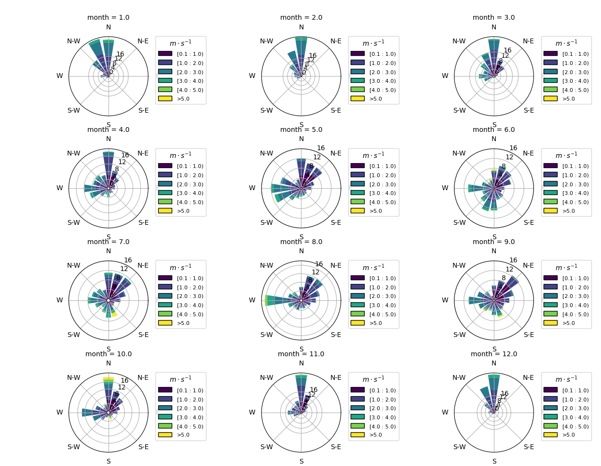
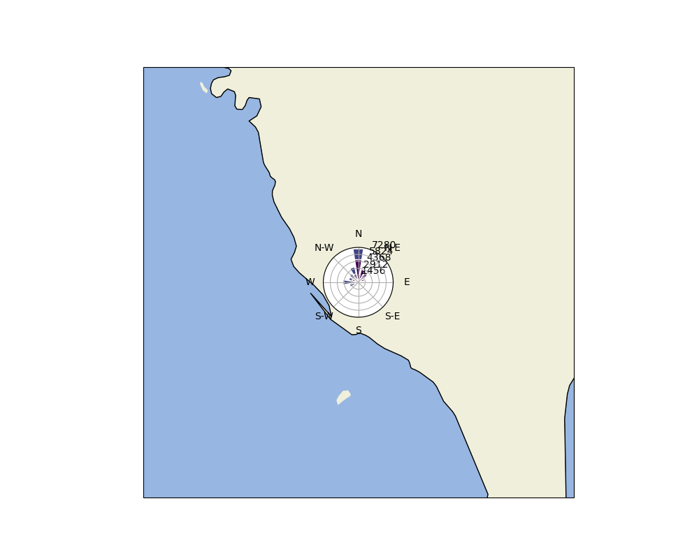

# CODiS-crawler_2024
新版中央氣象局觀測資料查詢系統（CODiS）爬蟲

在2024年發現中央氣象局觀測資料查詢系統（CODiS）更新版本了

原先是以修改網址方式即可以抓取需要的資料

目前改為互動式的網頁結構

再爬取上多了許多困難

最一開始我是使用Python的Selenium下載CSV檔

再用ggplot2畫圖

但Selenium的安裝跟使用就耗費時間

Chrome的版本太新也是一個大問題chromedriver支援還沒更新

要想像之前架設一個Shiny能自動爬取跟畫圖是有困難

退而求其次目前先以python的playwright進行使用

選擇playwright有兩大原因

一、Playwright 支援所有現代渲染引擎，包括 Chromium、WebKit 和 Firefox

二、跨平臺。在 Windows、Linux 和 macOS 上皆可使用，本機或在 CI 上進行測試，進行無頭(headless、不顯示瀏覽器)或有頭( headed、顯示瀏覽器 )測試

目前設計能將網站檔案下載CSV檔到指定路徑中

並且能在中斷後下次重新執行時比對是否下載過

繪製月份子圖

還有套上地圖兩個範例給大家參考

